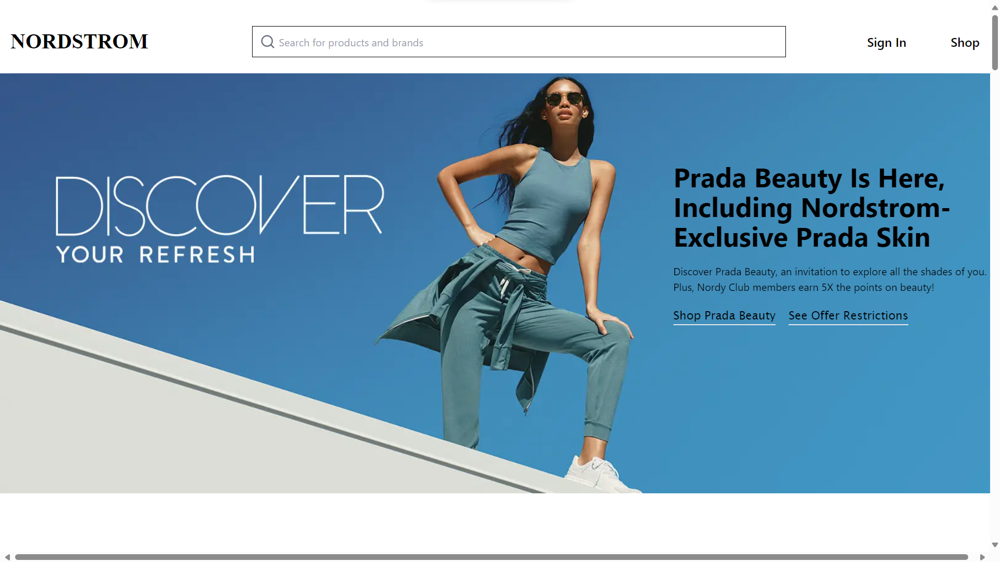

# NordStorm-clone-website

<h3>Buy latest and trending clothes</h3>

## project deploy link
  Deploy Link -
  Netlify: https://fluffy-haupia-7095af.netlify.app/
## Backend deploy link
  Deploy Link -
  Railway link: https://nordstrombackend-production.up.railway.app/

---

## Tech Stack Used: -

- #### Languages
  - `HTML`
  - `CSS`
  - `JavaScript `
  - `React`
  - `tailwind css`
  - `Node js`
  - `express`
  - `Mongo Atlas`
  
---
## Running it locally
- #### for both frontend and backend
- run `npm install` or `yarn install`
- run `npm run dev`

---
### Screenshots :camera:

---
- **Home Page**
---

---
- **Register page**
---

---

---
- **Log In page**

---

---
- **Product Page**
---

---
- **category section**
---

---
- **checkout page**
---

---
### About Project

> Nordstrom.com Clone

This repository contains a clone of Nordstrom.com, a popular online retail platform. The purpose of this project is to replicate the functionality and design of the Nordstrom website for educational and learning purposes.

Features:

Product Catalog: Browse through a wide range of products across various categories, mirroring the diverse offerings available on Nordstrom.com.

User Authentication: Users can create accounts, log in, and securely manage their profiles, including viewing order history and saving preferences.

Responsive Design: The website is designed to be responsive, ensuring a consistent and user-friendly experience across different devices and screen sizes.

Product Details: View comprehensive information about each product, including descriptions, pricing, availability, and customer reviews.

Checkout Process: Users can securely complete their purchases, inputting shipping and payment information with confidence.
---
